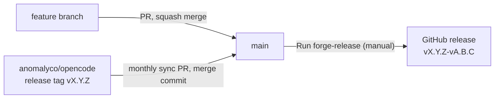

# Maintaining Forge

How changes land in Forge, how releases are cut, and how the fork stays in sync with upstream OpenCode.



## Branches and remotes

| Name              | What it is                                                                                                   |
| ----------------- | ------------------------------------------------------------------------------------------------------------ |
| `main` (origin)   | Forge's trunk. Every PR targets `main`, and every release is built from `main`.                              |
| feature branches  | Short-lived, branched from `main`, deleted after merge.                                                      |
| `upstream` remote | `git@github.com:anomalyco/opencode.git`. Read-only for us. Used once a month to pull in new OpenCode releases. |
| `dev` (origin)    | A leftover copy of upstream's `dev` from when the repo was forked. Don't target it, merge it, or push to it.  |

`AGENTS.md` and `CONTRIBUTING.md` say the default branch is `dev`. That's true for upstream, not for Forge.

### One-time setup

1. **Point `gh` at the fork.** This checkout has two GitHub remotes, and `gh` may pick `anomalyco/opencode`. If it does, `gh pr create`, `gh workflow run` and `gh release` act on upstream instead of Forge. Pin it once:

   ```bash
   gh repo set-default divyanshusingh2903/forge
   ```

2. **Allow both squash merges and merge commits** (Settings → General → Pull Requests). Feature PRs use squash; upstream sync PRs need a merge commit.
3. **Turn on rerere locally** so Git remembers how you resolved a conflict and reapplies it next month:

   ```bash
   git config rerere.enabled true
   ```

4. **Check the `upstream` remote exists** (`git remote -v`). If not:

   ```bash
   git remote add upstream git@github.com:anomalyco/opencode.git
   ```

## Making changes

1. **Branch from an up-to-date `main`.** Use a short hyphenated name of at most three words with no `feat/`-style prefix, e.g. `session-recovery` or `fix-scroll-state`.

   ```bash
   git switch main && git pull
   git switch -c fix-scroll-state
   ```

2. **Commit** with conventional messages: `type(scope): summary`, where type is one of `feat`, `fix`, `docs`, `chore`, `refactor`, `test`.
3. **Check it locally.** No CI runs on Forge PRs yet: upstream's `test` workflow needs Blacksmith runners, which this repo doesn't have, and `typecheck` only runs for PRs into `dev`. So before opening the PR:

   ```bash
   bun typecheck                                # from the repo root
   cd packages/<package-you-changed> && bun test  # tests can't run from the root
   ```

   For UI or desktop changes, also run the app (`bun dev:desktop`) and click through what you changed.

4. **Open the PR against `main`**, titled like a conventional commit:

   ```bash
   gh pr create --base main --title "fix(app): keep scroll position on tab switch"
   ```

5. **Squash and merge.** The PR title becomes the single commit on `main`. Delete the branch afterwards.

Merging a PR does **not** publish anything. `main` can collect several PRs before the next release.

## Versioning

Every Forge release has two versions joined together:

```
v1.18.30-v0.1.0
 └──┬──┘  └─┬─┘
 OpenCode  Forge
```

- **OpenCode part** (`1.18.30`): the upstream release Forge is based on, read from `packages/opencode/package.json`. It changes only when you sync from upstream. Never edit it by hand.
- **Forge part** (`0.1.0`): Forge's own version, stored in `forge.json`. It changes only when a release is run with a bump. It never resets when the OpenCode part changes.

Picking the Forge bump:

| Bump    | When                                                                                            |
| ------- | ----------------------------------------------------------------------------------------------- |
| `patch` | Bug fixes and small tweaks.                                                                     |
| `minor` | New features or behaviour changes.                                                              |
| `major` | Breaking changes, e.g. config or stored data that older builds can't read.                      |
| `none`  | Nothing Forge-specific changed. Use for the first release and for releases that only pick up an upstream sync. |

To see the version the next release would get, without changing anything:

```bash
./script/forge-version.ts
```

The desktop app reports the combined version (e.g. in the updater). The bundled OpenCode server keeps reporting the plain OpenCode version, because the opencode.ai API checks it.

## Releasing

Releases are always started by hand. Nothing is published automatically when PRs merge.

**From GitHub:** Actions → **forge-release** → Run workflow → branch `main` → pick the bump.

**From the terminal:**

```bash
gh workflow run forge-release.yml --ref main -f bump=patch
```

The workflow (`.github/workflows/forge-release.yml`) runs three jobs:

1. **version**: bumps `forge.json` (unless the bump is `none`), commits `release: vX.Y.Z-vA.B.C` to `main`, pushes the tag, and creates a **draft** release with auto-generated notes. It fails straight away if that tag already exists.
2. **build**: builds the desktop app on six runners (macOS arm64/x64, Windows x64/arm64, Linux x64/arm64) and uploads the installers to the draft release.
3. **publish**: uploads the auto-update files (`latest*.yml`), then publishes the release and marks it **Latest**. Installed apps see the update from that point on.

Installers have version-free names (`forge-desktop-<os>-<arch>.<ext>`), so these links always point to the newest release:

```
https://github.com/divyanshusingh2903/forge/releases/latest/download/forge-desktop-mac-arm64.dmg
https://github.com/divyanshusingh2903/forge/releases/latest/download/forge-desktop-win-x64.exe
https://github.com/divyanshusingh2903/forge/releases/latest/download/forge-desktop-linux-x86_64.AppImage
```

The first release: run with `none` to ship `v1.18.30-v0.1.0` exactly as `forge.json` says.

### If a release fails

A failed run leaves a draft release and a pushed tag. The `forge.json` bump is already on `main`, so don't bump again:

1. Fix the problem on `main` through a normal PR.
2. Delete the draft and its tag:

   ```bash
   gh release delete v1.18.30-v0.2.0 --cleanup-tag --yes
   ```

3. Run the workflow again with bump **`none`**. It rebuilds the same version from the new `main`.

### Signing

Signing is optional, and the workflow turns it on automatically when the secrets exist:

- **macOS**: without `APPLE_CERTIFICATE` / `APPLE_CERTIFICATE_PASSWORD`, builds are ad-hoc signed and not notarized. Users have to right-click → Open, or allow the app in System Settings → Privacy & Security. Add `APPLE_API_KEY`, `APPLE_API_KEY_PATH` (the `.p8` contents) and `APPLE_API_ISSUER` to notarize as well.
- **Windows**: without the `AZURE_*` secrets, builds are unsigned and SmartScreen shows a warning on first run.

## Syncing with upstream (monthly)

Merge upstream's latest **release tag**, not its `dev` branch. `dev` changes constantly and may be mid-refactor. A release tag is something upstream actually shipped, and it moves the OpenCode part of Forge's version to a real OpenCode version.

1. **Find the latest upstream release:**

   ```bash
   gh release view --repo anomalyco/opencode --json tagName -q .tagName   # e.g. v1.19.4
   ```

2. **Fetch it and branch from `main`:**

   ```bash
   git fetch upstream --tags
   git switch main && git pull
   git switch -c sync-v1.19.4
   ```

3. **Merge the tag:**

   ```bash
   git merge --no-ff v1.19.4 -m "chore: merge upstream opencode v1.19.4"
   ```

4. **Resolve conflicts.** Expect them wherever Forge has diverged:
   - **Rebranding**: `packages/desktop/` (icons, `electron-builder.config.ts`, `package.json`), `README.md`, `NOTICE.md`, `CONTRIBUTING.md`. Keep Forge's side.
   - **`packages/tui/`**: Forge deleted this package. If upstream changed files there, keep them deleted (`git rm -r packages/tui`).
   - **Forge features**: plan mode, permissions, session UI, notifications, MCP dialogs, the OpenAI WebSocket pool. Merge carefully; take upstream's changes where they don't undo Forge's behaviour.
   - **`bun.lock`**: take upstream's copy, then regenerate it so Forge's own dependencies are added back:

     ```bash
     git checkout --theirs bun.lock && bun install
     ```

   - **Release pipeline**: check that upstream hasn't changed anything `forge-release` depends on: `packages/desktop/scripts/prepare.ts`, `packages/desktop/scripts/finalize-latest-yml.ts`, `packages/desktop/electron-builder.config.ts`, `.github/actions/setup-bun`.
   - **New upstream workflows**: look at anything new in `.github/workflows/`. Most upstream workflows only run in `anomalyco/opencode`, but a new one without that check will run here too. Delete or disable those.

5. **Check it.** Confirm the new OpenCode version is picked up:

   ```bash
   bun install
   bun typecheck
   ./script/forge-version.ts   # the opencode= line should show the new version
   bun dev:desktop             # smoke test: open a session, run a prompt, try plan mode
   ```

   Run `bun test` in the packages with the most conflicts.

6. **Open the PR and merge it with a merge commit.** Never squash or rebase a sync PR: it would drop upstream's history, and Git would then treat all of those upstream commits as new again at the next sync, conflicting again.

   ```bash
   git push -u origin sync-v1.19.4
   gh pr create --base main --title "chore: merge upstream opencode v1.19.4"
   ```

7. **Release it.** Run `forge-release` with bump `none` if nothing Forge-specific is waiting to ship, e.g. `v1.19.4-v0.3.1`. If Forge PRs have merged since the last release, use the bump they call for.

### Monthly checklist

- [ ] Latest upstream release tag found and merged on a `sync-vX.Y.Z` branch
- [ ] Conflicts resolved; `packages/tui` still deleted; Forge branding intact
- [ ] `bun.lock` regenerated, `bun typecheck` passes, desktop app smoke-tested
- [ ] New or changed upstream workflows checked
- [ ] Sync PR merged into `main` with a **merge commit**
- [ ] `forge-release` run, release published and marked Latest
