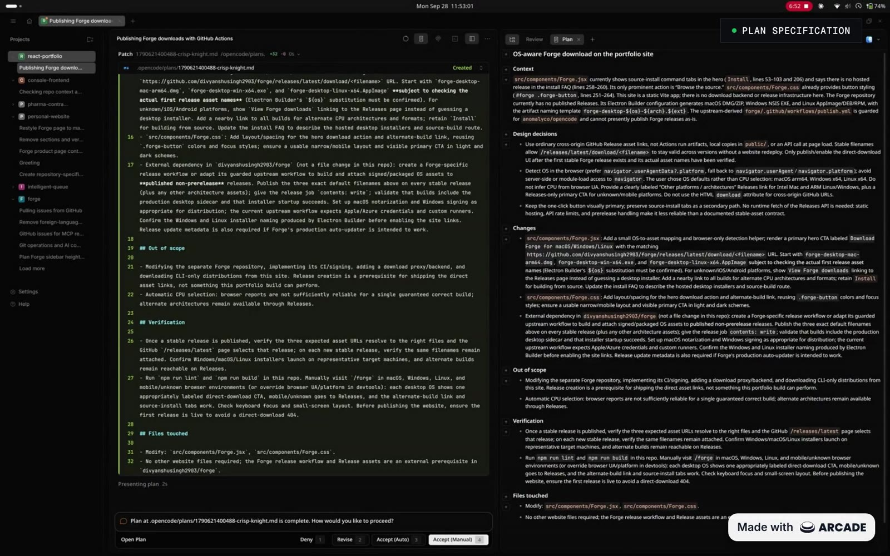

<div align="center">

[](https://divyanshusingh.site/forge)

**The coding agent that keeps you in the loop.**

The power of OpenCode, with the transparency and human-in-the-loop feel of Claude Code.

[](https://github.com/divyanshusingh2903/forge/releases/latest) [](LICENSE) [](https://divyanshusingh.site/forge)

[](https://divyanshusingh.site/forge-demo.mp4)

<sub>The plan agent presents its plan for review before any code changes. ▶ <a href="https://divyanshusingh.site/forge-demo.mp4">Watch the full demo</a> · <a href="https://divyanshusingh.site/forge">Forge website</a></sub>

</div>

> Forge is a fork of [OpenCode](https://github.com/anomalyco/opencode) (MIT licensed). See [NOTICE.md](NOTICE.md) for attribution.

---

### What this is

Forge is a personal fork of [OpenCode](https://github.com/anomalyco/opencode), steering it closer to how [Claude Code](https://claude.com/claude-code) feels to use: more human-in-the-loop, more transparent about what the agent is about to do before it does it, and less inclined to act autonomously without asking first.

This is a real GitHub fork of `anomalyco/opencode` (not a one-off copy), so it shares upstream's history and can pull in new OpenCode releases normally. It's a personal project, not a supported product — there's no install script or separate community channels.

### Download

Desktop installers for macOS, Windows, and Linux are published on [GitHub Releases](https://github.com/divyanshusingh2903/forge/releases/latest), or grab the right one for your OS from the [Forge website](https://divyanshusingh.site/forge).

The installers aren't code-signed yet. On macOS, if the first launch is blocked, open System Settings → Privacy & Security and click **Open Anyway** (or run `xattr -dr com.apple.quarantine /Applications/Forge.app`). On Windows, when SmartScreen appears, click **More info → Run anyway**. On Linux, make the AppImage executable.

### Running from source

```bash
git clone git@github.com:divyanshusingh2903/forge.git
cd forge
bun install

bun dev             # CLI, equivalent to the built `opencode` command
bun dev web         # headless server + web UI
bun dev serve       # headless API server only
```

To run the desktop app (Electron) in development:

```bash
bun run --cwd packages/desktop dev
```

See [CONTRIBUTING.md](CONTRIBUTING.md) for the full package breakdown, dev commands, and debugging notes.

### Agents

Two primary agents, switchable with `Tab` (`Shift+Tab` to cycle back):

- **build** - The default agent for development work. It asks before every file edit and bash command, and when a request looks like it needs design work first, it offers to switch to plan mode instead of diving in.
- **plan** - Research and design without touching your code. File edits are denied except for the plan file it writes under `.opencode/plans/`, and bash still asks first. When the plan is ready it presents it for review: approve it and hand off to **build** (approving each edit yourself, or letting it run in [Auto mode](#edit-modes)), send it back for revisions, or stop there.

Two subagents the primary agents can delegate to, or you can invoke with `@` in a message:

- **general** - Researches complex questions and runs multi-step tasks, including several units of work in parallel.
- **explore** - A fast, read-only agent for finding files, searching code, and answering questions about the codebase.

#### Edit modes

In the desktop and web app, the mode picker next to the prompt controls how much the agent can do without asking:

- **Manual** - The default. Every file edit and bash command waits for your approval.
- **Accept Edits** - File edits are approved automatically; bash commands and other permission requests still ask.
- **Auto** - Every permission request is approved automatically. Toggle it with `Cmd/Ctrl+Shift+A`.
- **Plan** - Switches to the **plan** agent. Picking any other mode switches back to **build**.

Modes apply to the current session, or to the project when you set one before starting a session. In the app, approving a plan with **Accept (Auto)** switches the session to **Auto** mode. Anything your config sets to `deny` stays denied in every mode.

#### Permission defaults

By default, agents also ask before touching directories outside the project, and build, plan, and general ask before reading `.env` files. All of these defaults can be overridden with `permission` in your config.

### Documentation

Forge shares most of its functionality with OpenCode, so [OpenCode's docs](https://opencode.ai/docs) are the best reference for configuration, providers, and agent behavior — nearly all of it applies here too.

### Contributing

This is a personal project, but if you're poking around the code, [CONTRIBUTING.md](./CONTRIBUTING.md) has the dev setup and architecture notes.

---

**Website:** [Forge](https://divyanshusingh.site/forge) · **Upstream:** [OpenCode on GitHub](https://github.com/anomalyco/opencode) · [opencode.ai](https://opencode.ai)
